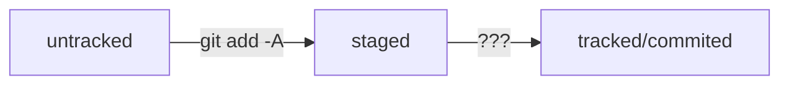

# header

---

## header2

---

*italic* or _italic_<br>
**bold enough?** or __like that?__
~~crossed text~~
1. first statement
2. another one

---

* oh
* my
* gosh

- it
- is
- really
- happening


[yandex?](https://yandex.ru)
[now with title](https://yandex.ru "Yandex here")

```python
def main():
    print('hello git')


if __name__ == '__main__':
    main()
```


